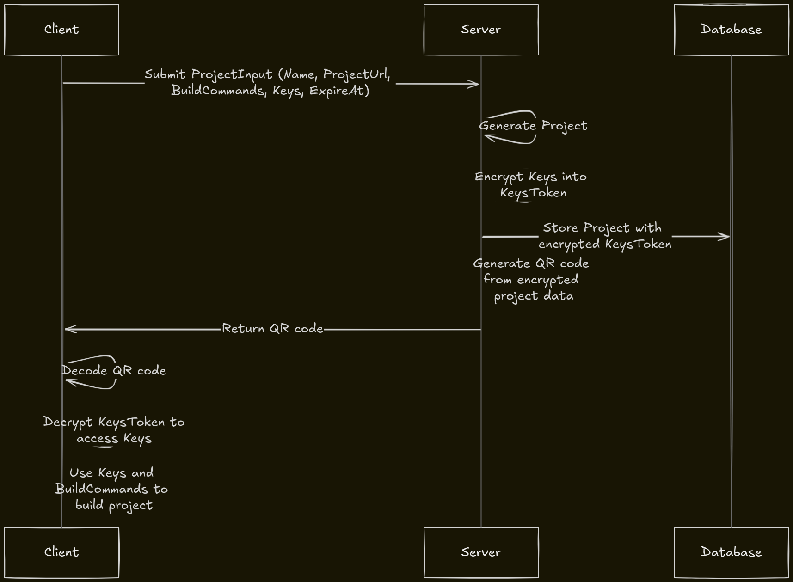

# Shinobi

  
  A secure client-server tool that allows project owners to manage builds without exposing sensitive information. The server encrypts sensitive keys and generates a token, which is then encoded into a QR code. Clients can scan the QR code to retrieve and decrypt the keys, combining them with build commands to execute the project setup without direct access to sensitive data. This approach helps ensure secure handling of credentials in collaborative environments.

 

##### Design

  

